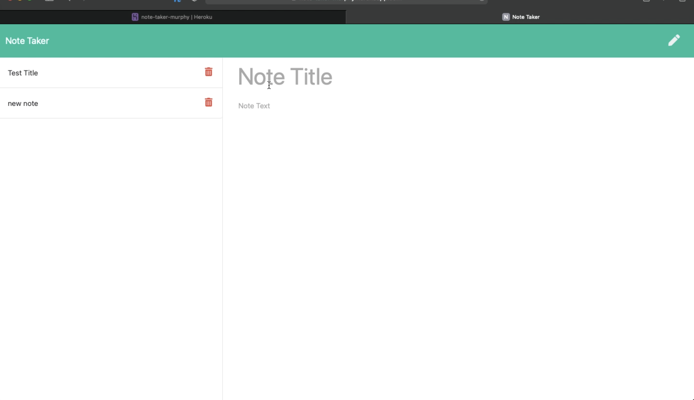

# Note Taker

# Table of Contents

- [Author](##Author)
- [Project Description](##Description)
- [Install](##Install)
- [Usage](##Usage)
- [Testing](##Testing)
- [License](##License)
- [Contributors](##Contributors)
- [Questions](##Questions)

## Author

Name: John Murphy
GitHub: jmurphy0

## Description

A simple app to takes notes online. Deployed by heroku and writes to a json file.

## Install

## Usage

https://note-taker-murphy.herokuapp.com

## Testing

no

## License

## Contributors

no

## Questions

no

video link: https://github.com/jmurphy0/hmwk10-NoteTaker/blob/master/Assets/hmwk10vid.mov
